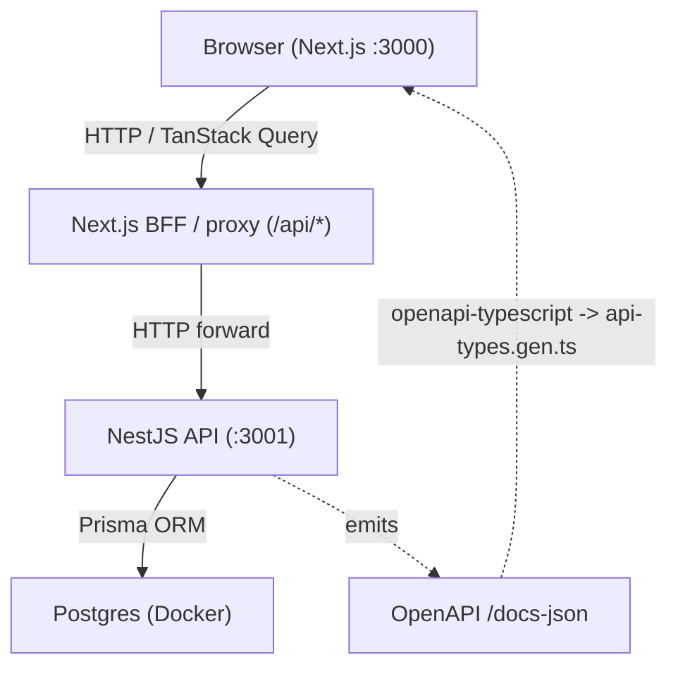

# Tuition Marketplace

A platform where parents post tutoring cases and tutors get invited to apply — connecting families with qualified educators efficiently.

## Architecture

Two **independent** services. There is no monorepo, no workspace, and no shared
package — the frontend talks to the backend over HTTP, and gets its API types by
generating them from the backend's OpenAPI document.

### Repository Layout

```
sibyl-test/
├── backend/            # NestJS + Prisma REST API (own pnpm project + biome)
├── frontend/           # Next.js 15 App Router (own pnpm project + biome)
├── docs/               # Plan, decisions, research, checkpoints, notes
├── .devcontainer/      # Compose-based dev container
└── docker-compose.yml  # Orchestrates db, minio, backend, frontend
```

The repository root holds only docs, dev-container config, and the compose file.
Each service is self-contained: its own `package.json`, `pnpm-lock.yaml`,
`node_modules`, `biome.json`, and `tsconfig.json`.

### High-Level Diagram



## Stack

| Layer | Technology |
|---|---|
| API Framework | NestJS (Express adapter) |
| ORM | Prisma |
| Database | Postgres (Docker) |
| Frontend Framework | Next.js 15 (App Router) |
| Styling | Tailwind v4 |
| Component Library | shadcn/ui |
| Data Fetching | TanStack Query |
| Contract types | OpenAPI → `openapi-typescript` |
| Testing | Vitest |
| Containerisation | Docker + Docker Compose |
| Package Manager | pnpm (per service) |

## Quick Start

### Prerequisites

- Node.js 22+
- pnpm (`npm i -g pnpm`)
- Docker + Docker Compose

### Setup (local)

```bash
# Backend
cd backend && pnpm install
pnpm dev          # NestJS on :3001  (Swagger at /docs)

# Frontend (separate terminal)
cd frontend && pnpm install
pnpm dev          # Next.js on :3000
```

### Setup (Docker)

```bash
cp .env.example .env
docker compose up -d        # db, minio, backend, frontend
```

### Regenerating frontend API types

With the backend running:

```bash
cd frontend && pnpm gen:types   # writes src/lib/api-types.gen.ts from /docs-json
```

### URLs

| Service | URL |
|---|---|
| Frontend (Next.js) | http://localhost:3000 |
| Backend (NestJS) | http://localhost:3001 |
| API Docs (Swagger) | http://localhost:3001/docs |

## Per-service scripts

Run from inside `backend/` or `frontend/`:

| Script | Description |
|---|---|
| `dev` | Start the service in watch mode |
| `build` | Build the service |
| `test` | Run Vitest suites |
| `lint` | Lint with Biome (`biome check .`) |
| `format` | Auto-format with Biome |

`frontend` additionally has `gen:types` (regenerate API types from OpenAPI).

## Docs

See [`docs/`](./docs/) for:

- [`plan.md`](./docs/plan.md) — project plan and milestones
- [`decision.md`](./docs/decision.md) — architecture decision records
- [`research.md`](./docs/research.md) — background research
- [`checkpoint.md`](./docs/checkpoint.md) — phase checkpoints
- [`requirement.md`](./docs/requirement.md) — requirements spec
- [`notes.md`](./docs/notes.md) — per-phase execution notes for review
- [`railway-deploy.md`](./docs/railway-deploy.md) — single-container Railway deploy

---

## Auth Design + Tradeoffs (D3)

**JWT access token + DB-persisted token records.** The access token is a signed JWT
whose `jti` hash is stored in `oauth_access_token`; every authenticated request
re-checks that row, so a token can be **revoked server-side** before its JWT expiry.
Refresh tokens are opaque random strings (only their sha256 hash is stored). Refresh
**rotation** revokes the old pair; **reuse of a revoked refresh token revokes the
user's entire token family** (theft mitigation).

- **Tradeoff:** a DB lookup per request (vs stateless JWT). Mitigated by an indexed
  unique hash lookup. The benefit is immediate revocation/logout — important for a
  marketplace handling personal documents.
- **FE storage:** tokens live in **httpOnly Secure cookies on the frontend domain
  only**, set by the Next BFF. The browser never sees a token in JS; the backend
  never sets cookies. The BFF forwards `Authorization: Bearer` and silently refreshes
  on 401. No token in localStorage or a non-httpOnly cookie.
- Passwords hashed with bcrypt; login is rate-limited (5/min/IP); generic
  "Invalid credentials" avoids user enumeration.

## Storage Design (D4)

**S3-compatible object storage (MinIO in dev).** Uploads are validated by
**magic bytes** (not the client extension/Content-Type), restricted to
pdf/docx/png/jpg, capped at 10 MB, and written under an opaque **UUID key**. Only the
original filename (sanitized) lives in the DB; the storage key and filesystem paths
**never appear in any API response**. Downloads re-check authorization through
`CaseAccessService` and return a **302 to a 60-second presigned URL**.

- **Schema:** `document` rows carry a polymorphic owner (`caseId?` / `tutorProfileId?`),
  `originalName`, `storedKey` (unique), `size`, `mime`, `uploadedById`.
- **Tradeoff:** presigned URLs offload bandwidth from the API but are time-boxed
  (60 s) so a leaked URL expires quickly.

---

## TODO: Deployment URLs

> **TODO:** Add staging and production URLs once deployed.

---

## TODO: Demo Credentials

> **TODO:** Add test account credentials for reviewers once seeded.

---

## TODO: Demo Video

> **TODO:** Add a link to the walkthrough video once recorded.
